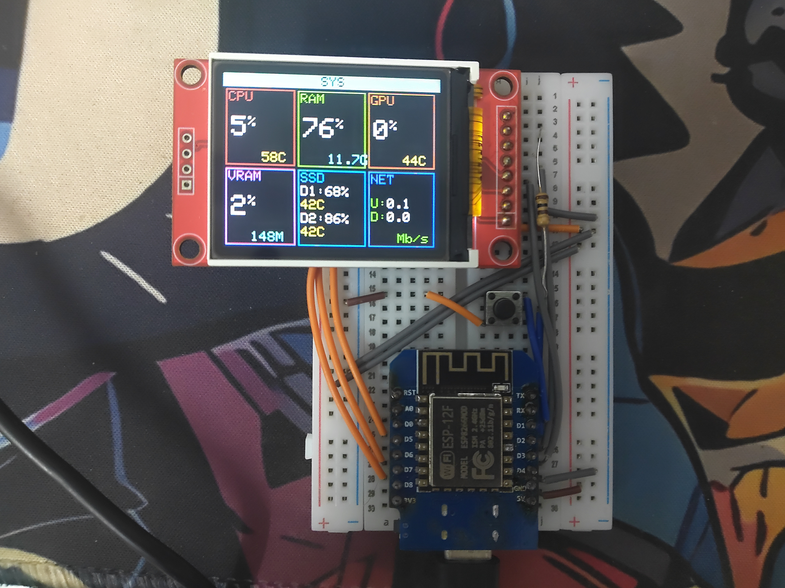
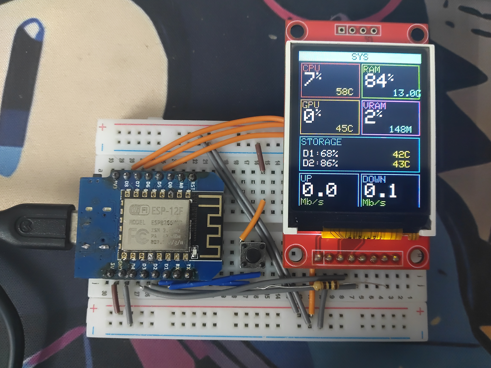
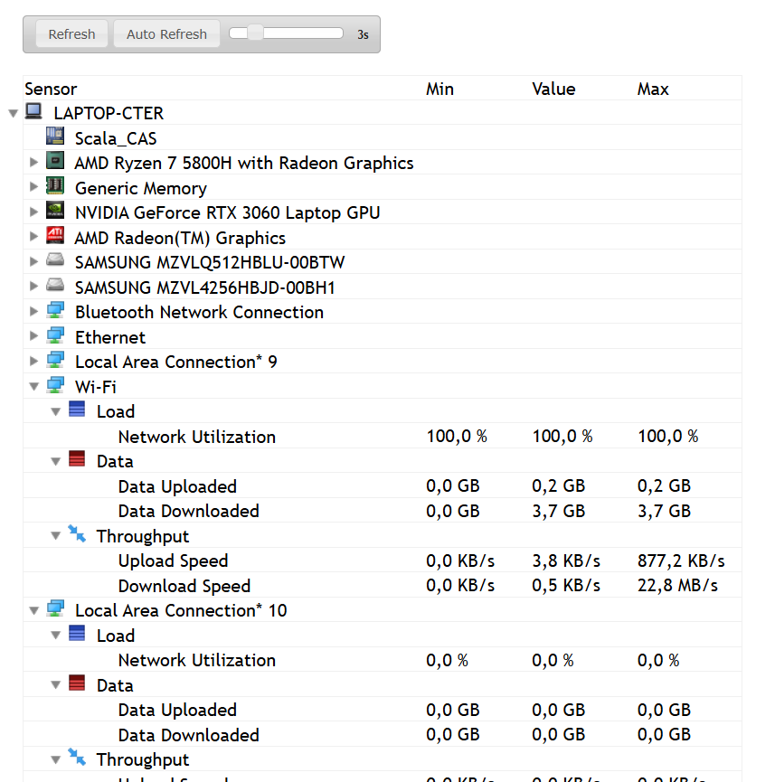
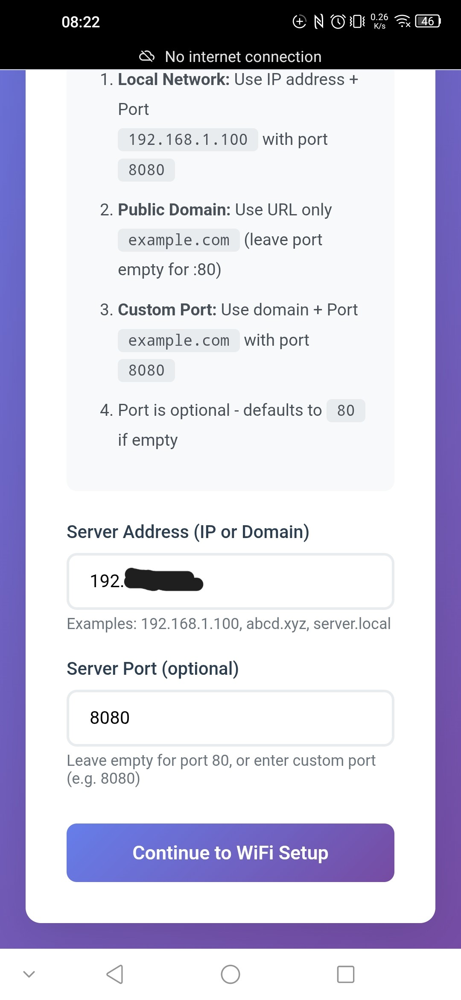
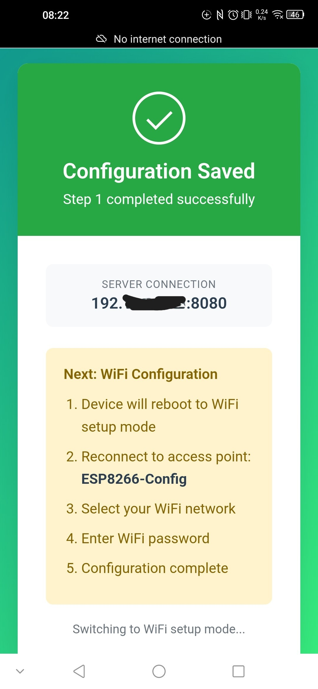
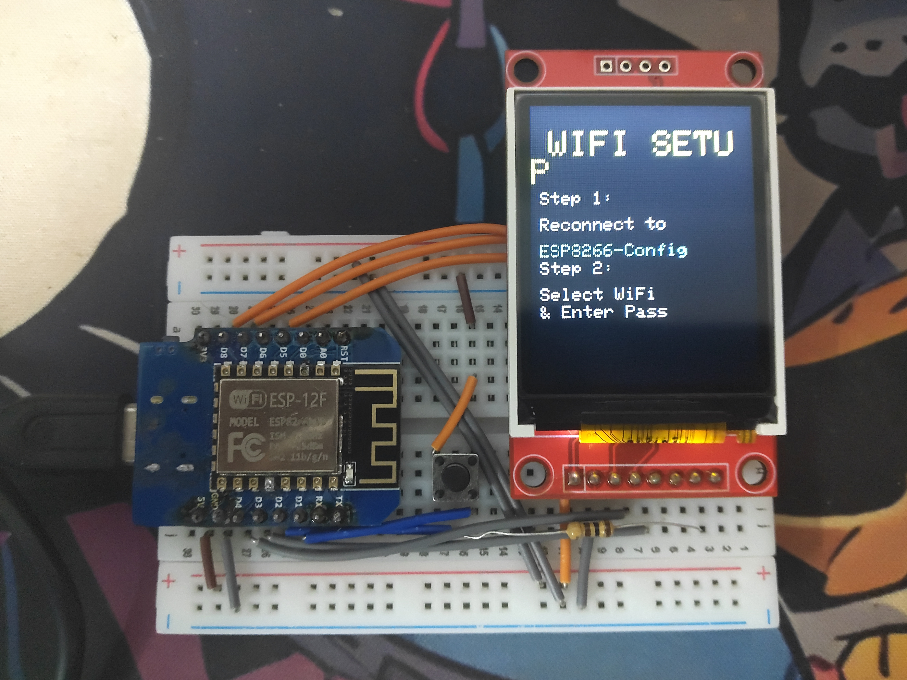

# 🖥️ System Info ESP8266 NodeMCU với TFT SPI Screen

<div align="center">


*Giám sát thông số hệ thống PC thời gian thực trên màn hình TFT nhỏ gọn*

[English](#english) | [Tiếng Việt](#tiếng-việt)

### 📸 Screenshots

<table>
  <tr>
    <td align="center">
      
      <br/>
      <b>Landscape Mode (3 columns)</b>
    </td>
    <td align="center">
      
      <br/>
      <b>Portrait Mode (2 columns)</b>
    </td>
  </tr>
  <tr>
    <td align="center">
      
      <br/>
      <b>My Dashboard Ideal</b>
    </td>
    <td align="center">
      
      <br/>
      <b>Libre Hardware Monitor Setup</b>
    </td>
  </tr>
</table>

</div>

---

# English

## 📝 Overview

Real-time PC system monitoring display using ESP8266 NodeMCU and TFT SPI screen. Monitor CPU, RAM, GPU, VRAM, Storage, and Network stats with a beautiful gaming-style dashboard UI.

### ✨ Features

- 🎮 **Gaming-Style Dashboard** - Modern tile-based layout with vibrant colors
- 📊 **Real-time Monitoring** - CPU, RAM, GPU, VRAM, Storage, Network stats
- 🔄 **Auto-Rotation** - Adaptive layout for portrait and landscape orientations
- 📱 **Multiple Display Support** - ST7735 (1.8"), ST7789 (2.4"), ILI9341 (2.8")
- ⚙️ **Web Config Portal** - Easy WiFi and server configuration via browser
- 🔧 **OTA Updates** - Over-the-air firmware updates
- ⚡ **Configurable Refresh Rate** - From 10 FPS to 1 FPS (100ms to 1000ms)
- 🌐 **WiFi Manager** - Auto-fallback to config portal on connection failure

### 🛠️ Hardware Requirements

#### ESP8266 Setup

- **Board**: ESP8266 NodeMCU (or compatible)
- **Display**: TFT SPI Screen
  - ST7735 (1.8" 128x160) - Recommended
  - ST7789 (1.3"-2.4" 240x240/240x320)
  - ILI9341 (2.2"-2.8" 240x320)
- **Button**: Push button (optional, for display on/off)

#### Wiring Diagram

```
ESP8266 NodeMCU → TFT Display (ST7735)
━━━━━━━━━━━━━━━━━━━━━━━━━━━━━━━━
D8 (GPIO 15)  →  CS   (Chip Select)
D4 (GPIO 2)   →  RST  (Reset)
D3 (GPIO 0)   →  DC   (Data/Command)
D2 (GPIO 4)   →  LED  (Backlight)
D7 (GPIO 13)  →  SDA  (MOSI)
D5 (GPIO 14)  →  SCK  (Clock)
3.3V          →  VCC
GND           →  GND

D1 (GPIO 5)   →  Button (to GND)
```

#### PC Setup

- **OS**: Windows 10/11, Linux, macOS
- **Software**:
  - [Libre Hardware Monitor](https://github.com/LibreHardwareMonitor/LibreHardwareMonitor/releases) (Windows)
  - Python 3.7+
  - pip packages: `flask`, `requests`, `python-dotenv`

### 🚀 Quick Start

#### 1. Setup PC Server

```bash
# Navigate to server folder
cd server

# Install dependencies
pip install flask requests python-dotenv

# Run server
python system_monitor_server.py
```

**Output:**

```
==================================================
System Monitor Server v1.8.3
==================================================
Server: http://192.168.1.100:8080
API: http://192.168.1.100:8080/system-info
...
```

**Note the IP address** - you'll need it for ESP8266 configuration.

#### 2. Setup Libre Hardware Monitor

1. Download from [GitHub Releases](https://github.com/LibreHardwareMonitor/LibreHardwareMonitor/releases)
2. Run as Administrator
3. Enable Remote Web Server:
   - `Options` → `Remote Web Server` → ✅ Enable
   - Port: `8085` (default)

#### 3. Flash ESP8266

**Using PlatformIO (Recommended):**

```bash
# Clone repository
git clone https://github.com/AnyaChann/System-Info-ESP8266-NodeMCU-with-TFT-SPI-screen.git
cd System-Info-ESP8266-NodeMCU-with-TFT-SPI-screen

# Configure display type in include/config.h
# Uncomment your display type:
# #define TFT_ST7735    // For 1.8" 128x160
# #define TFT_ST7789    // For 2.4" 240x320
# #define TFT_ILI9341   // For 2.8" 240x320

# Build and upload
platformio run --target upload
```

**Using Arduino IDE:**

1. Install libraries:
   - Adafruit GFX Library
   - Adafruit ST7735 and ST7789 Library
   - Adafruit ILI9341
   - WiFiManager
   - ArduinoJson
2. Copy all `.cpp` and `.h` files to sketch folder
3. Select board: `NodeMCU 1.0 (ESP-12E Module)`
4. Upload

#### 4. Configure WiFi and Server

**First Boot:**

<table>
  <tr>
  <td width="50%">
      
      <br/>
      <b>Step 1:</b> Connect to <code>ESP8266-Config</code> WiFi hotspot (password: <code>82668266</code>)
    </td>
    <td width="50%">
      
      <br/>
      <b>Step 2:</b> Enter Server IP (from python server) and Port <code>8080</code>
    </td>
  </tr>
  <tr>
  <td width="50%">
      
      <br/>
      <b>Step 3:</b> Configuration saved! Device will restart and connect
    </td>
    <td width="50%">
      
      <br/>
      <b>Step 4:</b> Browser opens to <code>192.168.4.1</code> - Configure your WiFi credentials -> Restart
    </td>
  </tr>
</table>

**Reconfigure anytime:**

- Hold button for 7 seconds
- Or device auto-enters config mode after 10 failed connections

### ⚙️ Configuration

#### Display Settings (`include/config.h`)

```cpp
// Display Type (uncomment one)
#define TFT_ST7735    // 1.8" 128x160
// #define TFT_ST7789    // 2.4" 240x320
// #define TFT_ILI9341   // 2.8" 240x320

// Screen Rotation (0-3)
#define SCREEN_ROTATION 0  // 0°, 90°, 180°, 270°

// Refresh Rate (milliseconds)
#define REFRESH_INTERVAL 100  // 100ms = ~10 FPS (recommended)
// Options: 33ms (30 FPS), 100ms (10 FPS), 200ms (5 FPS), 500ms (2 FPS)

// Backlight Auto-off
#define BACKLIGHT_TIMEOUT 60000  // 60 seconds
```

#### Server Settings (`server/.env`)

```env
# PC IP (auto-detect if empty)
PC_IP_ADDRESS=

# Server port
SERVER_PORT=8080

# Libre Hardware Monitor port
LIBRE_HW_MONITOR_PORT=8085

# Debug mode (true/false)
DEBUG_MODE=false

# Max disks to display
MAX_DISKS=2
```

### � Usage Guide

#### Button Controls

**Single Press (Short):**

- Toggle display ON/OFF manually
- Display will turn back on automatically when backlight timeout expires

**Long Press (7 seconds):**

- Enter WiFi configuration portal
- LED will blink rapidly to confirm
- Device creates hotspot `ESP8266-Config`

#### OTA Updates (Over-the-Air)

Update firmware wirelessly without USB cable:

**Method 1: PlatformIO OTA**

```bash
# Make sure ESP8266 is connected to WiFi
# Find device IP from serial monitor or router

# Upload via OTA
platformio run --target upload --upload-port 192.168.1.XXX
```

**Method 2: Arduino IDE OTA**

1. Go to `Tools` → `Port`
2. Select network port: `ESP8266 at 192.168.1.XXX`
3. Click Upload button

**Method 3: Web Browser OTA**

1. Open browser: `http://ESP8266_IP/update`
2. Click "Choose File" and select `.bin` firmware file
3. Click "Update" and wait for completion
4. Device will restart automatically

**Important Notes:**

- Ensure stable WiFi connection during OTA
- Don't power off during update process
- If OTA fails, use USB cable to reflash

### �🎨 Display Layouts

#### Portrait Mode (2 columns × 4 rows)

```
┌────────────────┐
│      SYS       │
├────────┬───────┤
│  CPU   │  RAM  │
│  45%   │  67%  │
│  38°C  │ 8.5GB │
├────────┼───────┤
│  GPU   │ VRAM  │
│  32%   │  28%  │
│  42°C  │  2GB  │
├────────┴───────┤
│    STORAGE     │
│ D1:45% D2:67%  │
│  38°C    42°C  │
├────────┬───────┤
│   UP   │ DOWN  │
│  12    │  45   │
│  Mb/s  │ Mb/s  │
└────────┴───────┘
```

#### Landscape Mode (3 columns × 2 rows)

```
┌─────────────────────────┐
│          SYS            │
├────────┬────────┬───────┤
│  CPU   │  RAM   │  GPU  │
│  45%   │  67%   │  32%  │
│  38°C  │ 8.5GB  │  42°C │
├────────┼────────┼───────┤
│  VRAM  │  SSD   │  NET  │
│  28%   │ D1:45% │ U:12  │
│  2GB   │  38°C  │ D:45  │
└────────┴────────┴───────┘
```

### 🔧 Troubleshooting

**Display not working?**

- Check wiring connections
- Verify display type in `config.h`
- Try different `SCREEN_ROTATION` values

**WiFi connection fails?**

- Hold button 7 seconds to enter config mode
- Check WiFi credentials
- Ensure 2.4GHz network (ESP8266 doesn't support 5GHz)

**No data from server?**

- Verify Libre Hardware Monitor is running
- Check server IP and port in config portal
- Test: `curl http://SERVER_IP:8080/system-info`
- Allow Python through Windows Firewall

**Display too slow?**

- Decrease `REFRESH_INTERVAL` in `config.h`
- Recommended: 100ms for smooth updates

### 📚 Project Structure

```
System-Info-ESP8266-NodeMCU/
├── include/               # Header files
│   ├── config.h          # Main configuration
│   ├── display_manager.h # Display driver
│   ├── network_manager.h # WiFi & HTTP
│   └── ...
├── src/                  # Source files
│   ├── main.cpp         # Main program
│   ├── display_manager.cpp
│   └── ...
├── server/              # Python server
│   ├── system_monitor_server.py
│   ├── .env            # Server config
│   └── requirements.txt
├── platformio.ini      # PlatformIO config
└── README.md          # This file
```

### 🤝 Contributing

Contributions are welcome! Please:

1. Fork the repository
2. Create feature branch (`git checkout -b feature/amazing-feature`)
3. Commit changes (`git commit -m 'Add amazing feature'`)
4. Push to branch (`git push origin feature/amazing-feature`)
5. Open Pull Request

### 📄 License

This project is licensed under the MIT License - see [LICENSE](LICENSE) file for details.

### 🙏 Acknowledgments

- [Libre Hardware Monitor](https://github.com/LibreHardwareMonitor/LibreHardwareMonitor) - Hardware monitoring
- [Adafruit GFX Library](https://github.com/adafruit/Adafruit-GFX-Library) - Graphics library
- [WiFiManager](https://github.com/tzapu/WiFiManager) - WiFi configuration

---

# Tiếng Việt

## 📝 Tổng quan

Màn hình giám sát thông số PC thời gian thực sử dụng ESP8266 NodeMCU và màn hình TFT SPI. Theo dõi các thông số CPU, RAM, GPU, VRAM, Storage và Network với giao diện dashboard phong cách gaming đẹp mắt.

### ✨ Tính năng

- 🎮 **Dashboard Phong Cách Gaming** - Layout dạng tile hiện đại với màu sắc sống động
- 📊 **Giám Sát Thời Gian Thực** - CPU, RAM, GPU, VRAM, Storage, Network
- 🔄 **Tự Động Xoay** - Layout tự động thích ứng với chế độ dọc và ngang
- 📱 **Hỗ Trợ Nhiều Màn Hình** - ST7735 (1.8"), ST7789 (2.4"), ILI9341 (2.8")
- ⚙️ **Cổng Config Web** - Cấu hình WiFi và server dễ dàng qua trình duyệt
- 🔧 **Cập Nhật OTA** - Cập nhật firmware qua mạng không dây
- ⚡ **Tốc Độ Làm Mới Linh Hoạt** - Từ 10 FPS đến 1 FPS (100ms đến 1000ms)
- 🌐 **Quản Lý WiFi** - Tự động chuyển về chế độ config khi mất kết nối

### 🛠️ Yêu cầu phần cứng

#### Thiết lập ESP8266

- **Board**: ESP8266 NodeMCU (hoặc tương thích)
- **Màn hình**: TFT SPI Screen
  - ST7735 (1.8" 128x160) - Khuyến nghị
  - ST7789 (1.3"-2.4" 240x240/240x320)
  - ILI9341 (2.2"-2.8" 240x320)
- **Nút bấm**: Push button (tùy chọn, để bật/tắt màn hình)

#### Sơ đồ đấu nối

```
ESP8266 NodeMCU → Màn hình TFT (ST7735)
━━━━━━━━━━━━━━━━━━━━━━━━━━━━━━━━━━━
D8 (GPIO 15)  →  CS   (Chip Select)
D4 (GPIO 2)   →  RST  (Reset)
D3 (GPIO 0)   →  DC   (Data/Command)
D2 (GPIO 4)   →  LED  (Đèn nền)
D7 (GPIO 13)  →  SDA  (MOSI)
D5 (GPIO 14)  →  SCK  (Clock)
3.3V          →  VCC
GND           →  GND

D1 (GPIO 5)   →  Nút bấm (nối GND)
```

#### Thiết lập PC

- **OS**: Windows 10/11, Linux, macOS
- **Phần mềm**:
  - [Libre Hardware Monitor](https://github.com/LibreHardwareMonitor/LibreHardwareMonitor/releases) (Windows)
  - Python 3.7+
  - pip packages: `flask`, `requests`, `python-dotenv`

### 🚀 Bắt đầu nhanh

#### 1. Thiết lập Server trên PC

```bash
# Di chuyển đến thư mục server
cd server

# Cài đặt thư viện
pip install flask requests python-dotenv

# Chạy server
python system_monitor_server.py
```

**Kết quả:**

```
==================================================
System Monitor Server v1.8.2
==================================================
Server: http://192.168.1.100:8080
API: http://192.168.1.100:8080/system-info
...
```

**Ghi nhớ địa chỉ IP** - bạn sẽ cần nó để cấu hình ESP8266.

#### 2. Thiết lập Libre Hardware Monitor

1. Tải từ [GitHub Releases](https://github.com/LibreHardwareMonitor/LibreHardwareMonitor/releases)
2. Chạy với quyền Administrator
3. Bật Remote Web Server:
   - `Options` → `Remote Web Server` → ✅ Enable
   - Port: `8085` (mặc định)

#### 3. Flash ESP8266

**Sử dụng PlatformIO (Khuyến nghị):**

```bash
# Clone repository
git clone https://github.com/AnyaChann/System-Info-ESP8266-NodeMCU-with-TFT-SPI-screen.git
cd System-Info-ESP8266-NodeMCU-with-TFT-SPI-screen

# Cấu hình loại màn hình trong include/config.h
# Bỏ comment loại màn hình của bạn:
# #define TFT_ST7735    // Cho màn 1.8" 128x160
# #define TFT_ST7789    // Cho màn 2.4" 240x320
# #define TFT_ILI9341   // Cho màn 2.8" 240x320

# Build và upload
platformio run --target upload
```

**Sử dụng Arduino IDE:**

1. Cài đặt thư viện:
   - Adafruit GFX Library
   - Adafruit ST7735 and ST7789 Library
   - Adafruit ILI9341
   - WiFiManager
   - ArduinoJson
2. Copy tất cả file `.cpp` và `.h` vào thư mục sketch
3. Chọn board: `NodeMCU 1.0 (ESP-12E Module)`
4. Upload

#### 4. Cấu hình WiFi và Server

**Lần khởi động đầu:**

<table>
  <tr>
    <td width="50%">
      
      <br/>
      <b>Bước 1:</b> Kết nối vào WiFi hotspot <code>ESP8266-Config</code> (mật khẩu: <code>82668266</code>)
    </td>
    <td width="50%">
      
      <br/>
      <b>Bước 2:</b> Nhập Server IP (từ python server) và Port <code>8080</code>
    </td>
  </tr>
   <tr>
  <td width="50%">
      
      <br/>
      <b>Bước 3:</b> Cấu hình đã lưu! Thiết bị sẽ khởi động lại và kết nối
    </td>
    <td width="50%">
      
      <br/>
      <b>Bước 4:</b> Trình duyệt mở tại <code>192.168.4.1</code> - Nhập thông tin WiFi của bạn -> Restart
    </td>
  </tr>
</table>

**Cấu hình lại bất cứ lúc nào:**

- Giữ nút bấm 7 giây
- Hoặc thiết bị tự động vào chế độ config sau 10 lần kết nối thất bại

### ⚙️ Cấu hình

#### Cài đặt Màn hình (`include/config.h`)

```cpp
// Loại màn hình (bỏ comment 1 dòng)
#define TFT_ST7735    // 1.8" 128x160
// #define TFT_ST7789    // 2.4" 240x320
// #define TFT_ILI9341   // 2.8" 240x320

// Góc xoay màn hình (0-3)
#define SCREEN_ROTATION 0  // 0°, 90°, 180°, 270°

// Tốc độ làm mới (milliseconds)
#define REFRESH_INTERVAL 100  // 100ms = ~10 FPS (khuyến nghị)
// Tùy chọn: 33ms (30 FPS), 100ms (10 FPS), 200ms (5 FPS), 500ms (2 FPS)

// Tự động tắt đèn nền
#define BACKLIGHT_TIMEOUT 60000  // 60 giây
```

#### Cài đặt Server (`server/.env`)

```env
# IP của PC (để trống để tự động phát hiện)
PC_IP_ADDRESS=

# Port server
SERVER_PORT=8080

# Port Libre Hardware Monitor
LIBRE_HW_MONITOR_PORT=8085

# Chế độ debug (true/false)
DEBUG_MODE=false

# Số ổ đĩa tối đa hiển thị
MAX_DISKS=2
```

### � Hướng dẫn sử dụng

#### Điều khiển bằng nút bấm

**Nhấn ngắn (1 lần):**

- Bật/tắt màn hình thủ công
- Màn hình sẽ tự động bật lại khi hết thời gian chờ đèn nền

**Nhấn giữ (7 giây):**

- Vào chế độ cấu hình WiFi
- LED sẽ nhấp nháy nhanh để xác nhận
- Thiết bị tạo hotspot `ESP8266-Config`

#### Cập nhật OTA (Over-the-Air)

Cập nhật firmware qua mạng không dây, không cần cáp USB:

**Phương pháp 1: PlatformIO OTA**

```bash
# Đảm bảo ESP8266 đã kết nối WiFi
# Tìm IP của thiết bị từ serial monitor hoặc router

# Upload qua OTA
platformio run --target upload --upload-port 192.168.1.XXX
```

**Phương pháp 2: Arduino IDE OTA**

1. Vào `Tools` → `Port`
2. Chọn cổng mạng: `ESP8266 at 192.168.1.XXX`
3. Nhấn nút Upload

**Phương pháp 3: Trình duyệt Web**

1. Mở trình duyệt: `http://ESP8266_IP/update`
2. Nhấn "Choose File" và chọn file firmware `.bin`
3. Nhấn "Update" và đợi hoàn thành
4. Thiết bị sẽ tự động khởi động lại

**Lưu ý quan trọng:**

- Đảm bảo kết nối WiFi ổn định trong quá trình OTA
- Không tắt nguồn khi đang cập nhật
- Nếu OTA thất bại, dùng cáp USB để flash lại

### �🎨 Bố cục hiển thị

#### Chế độ dọc (2 cột × 4 hàng)

```
┌────────────────┐
│      SYS       │
├────────┬───────┤
│  CPU   │  RAM  │
│  45%   │  67%  │
│  38°C  │ 8.5GB │
├────────┼───────┤
│  GPU   │ VRAM  │
│  32%   │  28%  │
│  42°C  │  2GB  │
├────────┴───────┤
│    STORAGE     │
│ D1:45% D2:67%  │
│  38°C    42°C  │
├────────┬───────┤
│   UP   │ DOWN  │
│  12    │  45   │
│  Mb/s  │ Mb/s  │
└────────┴───────┘
```

#### Chế độ ngang (3 cột × 2 hàng)

```
┌─────────────────────────┐
│          SYS            │
├────────┬────────┬───────┤
│  CPU   │  RAM   │  GPU  │
│  45%   │  67%   │  32%  │
│  38°C  │ 8.5GB  │  42°C │
├────────┼────────┼───────┤
│  VRAM  │  SSD   │  NET  │
│  28%   │ D1:45% │ U:12  │
│  2GB   │  38°C  │ D:45  │
└────────┴────────┴───────┘
```

### 🔧 Khắc phục sự cố

**Màn hình không hoạt động?**

- Kiểm tra các kết nối dây
- Xác minh loại màn hình trong `config.h`
- Thử các giá trị `SCREEN_ROTATION` khác nhau

**Kết nối WiFi thất bại?**

- Giữ nút 7 giây để vào chế độ config
- Kiểm tra thông tin WiFi
- Đảm bảo mạng 2.4GHz (ESP8266 không hỗ trợ 5GHz)

**Không nhận được dữ liệu từ server?**

- Kiểm tra Libre Hardware Monitor đang chạy
- Kiểm tra IP và port server trong cổng config
- Test: `curl http://SERVER_IP:8080/system-info`
- Cho phép Python qua Windows Firewall

**Màn hình quá chậm?**

- Giảm `REFRESH_INTERVAL` trong `config.h`
- Khuyến nghị: 100ms cho cập nhật mượt mà

### 📚 Cấu trúc dự án

```
System-Info-ESP8266-NodeMCU/
├── include/               # File header
│   ├── config.h          # Cấu hình chính
│   ├── display_manager.h # Driver màn hình
│   ├── network_manager.h # WiFi & HTTP
│   └── ...
├── src/                  # File nguồn
│   ├── main.cpp         # Chương trình chính
│   ├── display_manager.cpp
│   └── ...
├── server/              # Python server
│   ├── system_monitor_server.py
│   ├── .env            # Cấu hình server
│   └── requirements.txt
├── platformio.ini      # Cấu hình PlatformIO
└── README.md          # File này
```

### 🤝 Đóng góp

Mọi đóng góp đều được chào đón! Vui lòng:

1. Fork repository
2. Tạo nhánh tính năng (`git checkout -b feature/tinh-nang-tuyet-voi`)
3. Commit thay đổi (`git commit -m 'Thêm tính năng tuyệt vời'`)
4. Push lên nhánh (`git push origin feature/tinh-nang-tuyet-voi`)
5. Tạo Pull Request

### 📄 Giấy phép

Dự án này được cấp phép theo giấy phép MIT - xem file [LICENSE](LICENSE) để biết chi tiết.

### 🙏 Cảm ơn

- [Libre Hardware Monitor](https://github.com/LibreHardwareMonitor/LibreHardwareMonitor) - Giám sát phần cứng
- [Adafruit GFX Library](https://github.com/adafruit/Adafruit-GFX-Library) - Thư viện đồ họa
- [WiFiManager](https://github.com/tzapu/WiFiManager) - Cấu hình WiFi

---

**Made with ❤️ by [AnyaChann](https://github.com/AnyaChann)**

⭐ Star this repo if you find it useful!

</div>
